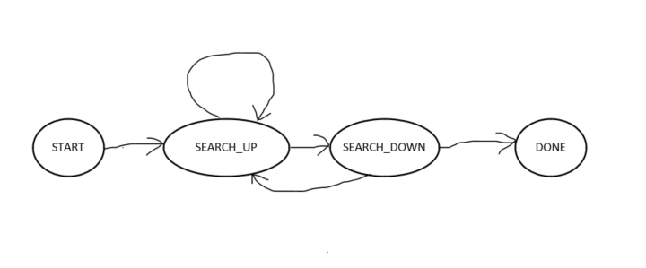

## Overview
Goal of this project is to build a PID controller to steer the car in a simulator. Simulator provides cte (Cross track error) to our program periodically and our program is expected to send steering angle to simulator to keep the car on road.

PID stands for Proportional(P) Integral(I) Derivative(D). A PID controller combines these three components to produce a control signal. In our case, this control signal is steering angle. 

Control Signal = Kp * cte + Ki * sum of errors + Kd * diff_error

### Proportional Component (P)
Proportional component outputs steering angle proportional to the Cross Track error. Gain constant is Kp.

P = Kp x CTE

If we use P component alone, the vehicle will oscillate around its intended trajectory. Increasing Kp will cause it to steer more aggressively towards the target lane. But it will also cause the car to oscillate more.

### Derivative Component (D)
Derivative component outputs a steering angle proportional to the difference in error. This acts against P components tendency to oscillate since it tries to pull away from target as the error decreases.

D = Kd x diff_cte

Where diff_cte = cte - cte_prev

### Integral Component (I)
Integral component outputs a steering angle proportional to the sum of errors (accumulated error). This helps to compensate "Systemic Bias".

I = Ki x Sum_of_errors


## Reflection

There are two main steps in implementing this project.

1. Implement PID controller.
2. Fine tune the gains of PID controller.

First part (Implement PID controller) is pretty straight forward and is implemented in PID.cpp and PID.h. 

Second part is slightly more challenging. Based on various discussions from Knowledge (https://knowledge.udacity.com/?nanodegree=nd013&page=1&project=289&rubric=1972) page, I have decided to start this with manual trial and error and then once a reasonably good parameters are found, use Twiddle to fine tune the parameters further.

### Manual Trail and Error
Started with setting all the parameters Kp, Ki and Kd to zero. This resulted in car driving straight irrespective of the error and quickly went outside the road and crashed. Next Kp value was set to 1, then car started move along the road but was oscillating. Also noticed that when Kp value was reduced, oscillation also reduced. 

Next step was to adjust the derivative gain (Kd). Adjusted the Kd such that oscillation has reduced to reasonable level and car was able stay on track for one entire lap. 

Next step was to adjust gain of Integral component (Ki). Purpose of this component is to compensate for Systemic Bias. It looked like higher values of Ki was causing the car to overshoot and oscillate more. A very small value of 0.0001 was set in the end. 

Manual Trial and Error output,

Kp = 0.1
Ki = 0.001
Kd = 1.5


### Twiddle
Twiddle was implemented to fine tune the parameters (Kp, Ki, Kd). This is implemented in twiddle.cpp and twiddle.h. Basic idea of the twiddle is to adjust (increase or decrease) one parameter at a time and see if it helps to improve the error. Even though twiddle is not very complex to implement as a standalone program, integrating with the simulator application was not very straight forward. Twiddle algorithm implemented in the class lesson adjusts parameter (p) and then invokes a run() function that returns the cte and based on the current cte, it would do the next step. To fit the twiddle algorithm in to our application, it was organized as a state machine with following state.

* START : First state
* SEARCH_UP : Searching for optimal p[i] by incrementing it by dp[i]
* SEARCH_DOWN : Searching for optimal p[i] by decrementing it by dp[i]
* DONE : Completed. sum(dp) < threshold

State Diagram is in src/state.png




Twiddle mode can be enabled in main.cpp by setting twiddleMode to true. When twiddle is enabled, twiddle algorithm is activated and adjusts the p until sum(dp) < threshold. Data is collected while twiddle was running and is captured in src/data.txt. This shows how the algorithm adjusts the parameters.

When twiddleMode set to false, main.cpp uses just PID class to steer the car.

It turns out that in the twiddle came up with the exact same parameters that we started with (output of manual trial and error step).

Kp = 0.1
Ki = 0.001
Kd = 1.5

This could be due to,

1. It just so happened that the manual setting was too good.

OR

2. There is some subtle bug in the twiddle implementation that I am not able to see.


## Conclusion
With the above mentioned parameters, I was able to run the car without going out of the road on simulator. I have not implemented the throttle/speed control and can be done using similar approach.


***Below description is provided by Udacity***
#


# CarND-Controls-PID
Self-Driving Car Engineer Nanodegree Program

---

## Dependencies

* cmake >= 3.5
 * All OSes: [click here for installation instructions](https://cmake.org/install/)
* make >= 4.1(mac, linux), 3.81(Windows)
  * Linux: make is installed by default on most Linux distros
  * Mac: [install Xcode command line tools to get make](https://developer.apple.com/xcode/features/)
  * Windows: [Click here for installation instructions](http://gnuwin32.sourceforge.net/packages/make.htm)
* gcc/g++ >= 5.4
  * Linux: gcc / g++ is installed by default on most Linux distros
  * Mac: same deal as make - [install Xcode command line tools]((https://developer.apple.com/xcode/features/)
  * Windows: recommend using [MinGW](http://www.mingw.org/)
* [uWebSockets](https://github.com/uWebSockets/uWebSockets)
  * Run either `./install-mac.sh` or `./install-ubuntu.sh`.
  * If you install from source, checkout to commit `e94b6e1`, i.e.
    ```
    git clone https://github.com/uWebSockets/uWebSockets 
    cd uWebSockets
    git checkout e94b6e1
    ```
    Some function signatures have changed in v0.14.x. See [this PR](https://github.com/udacity/CarND-MPC-Project/pull/3) for more details.
* Simulator. You can download these from the [project intro page](https://github.com/udacity/self-driving-car-sim/releases) in the classroom.

Fellow students have put together a guide to Windows set-up for the project [here](https://s3-us-west-1.amazonaws.com/udacity-selfdrivingcar/files/Kidnapped_Vehicle_Windows_Setup.pdf) if the environment you have set up for the Sensor Fusion projects does not work for this project. There's also an experimental patch for windows in this [PR](https://github.com/udacity/CarND-PID-Control-Project/pull/3).

## Basic Build Instructions

1. Clone this repo.
2. Make a build directory: `mkdir build && cd build`
3. Compile: `cmake .. && make`
4. Run it: `./pid`. 

Tips for setting up your environment can be found [here](https://classroom.udacity.com/nanodegrees/nd013/parts/40f38239-66b6-46ec-ae68-03afd8a601c8/modules/0949fca6-b379-42af-a919-ee50aa304e6a/lessons/f758c44c-5e40-4e01-93b5-1a82aa4e044f/concepts/23d376c7-0195-4276-bdf0-e02f1f3c665d)

## Editor Settings

We've purposefully kept editor configuration files out of this repo in order to
keep it as simple and environment agnostic as possible. However, we recommend
using the following settings:

* indent using spaces
* set tab width to 2 spaces (keeps the matrices in source code aligned)

## Code Style

Please (do your best to) stick to [Google's C++ style guide](https://google.github.io/styleguide/cppguide.html).

## Project Instructions and Rubric

Note: regardless of the changes you make, your project must be buildable using
cmake and make!

More information is only accessible by people who are already enrolled in Term 2
of CarND. If you are enrolled, see [the project page](https://classroom.udacity.com/nanodegrees/nd013/parts/40f38239-66b6-46ec-ae68-03afd8a601c8/modules/f1820894-8322-4bb3-81aa-b26b3c6dcbaf/lessons/e8235395-22dd-4b87-88e0-d108c5e5bbf4/concepts/6a4d8d42-6a04-4aa6-b284-1697c0fd6562)
for instructions and the project rubric.

## Hints!

* You don't have to follow this directory structure, but if you do, your work
  will span all of the .cpp files here. Keep an eye out for TODOs.

## Call for IDE Profiles Pull Requests

Help your fellow students!

We decided to create Makefiles with cmake to keep this project as platform
agnostic as possible. Similarly, we omitted IDE profiles in order to we ensure
that students don't feel pressured to use one IDE or another.

However! I'd love to help people get up and running with their IDEs of choice.
If you've created a profile for an IDE that you think other students would
appreciate, we'd love to have you add the requisite profile files and
instructions to ide_profiles/. For example if you wanted to add a VS Code
profile, you'd add:

* /ide_profiles/vscode/.vscode
* /ide_profiles/vscode/README.md

The README should explain what the profile does, how to take advantage of it,
and how to install it.

Frankly, I've never been involved in a project with multiple IDE profiles
before. I believe the best way to handle this would be to keep them out of the
repo root to avoid clutter. My expectation is that most profiles will include
instructions to copy files to a new location to get picked up by the IDE, but
that's just a guess.

One last note here: regardless of the IDE used, every submitted project must
still be compilable with cmake and make./

## How to write a README
A well written README file can enhance your project and portfolio.  Develop your abilities to create professional README files by completing [this free course](https://www.udacity.com/course/writing-readmes--ud777).

